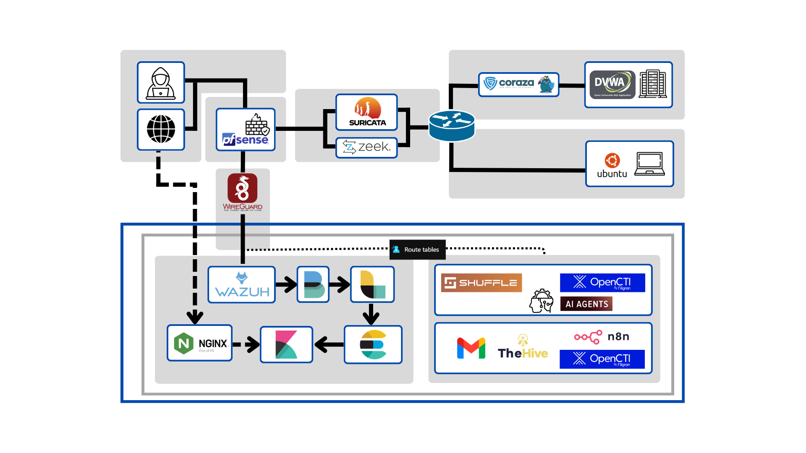
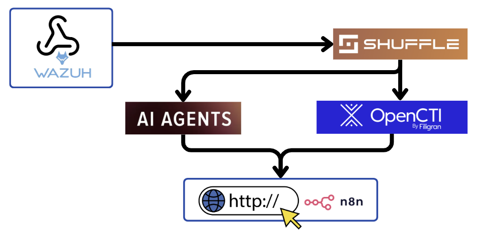
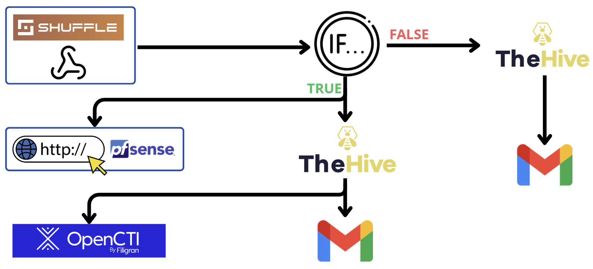
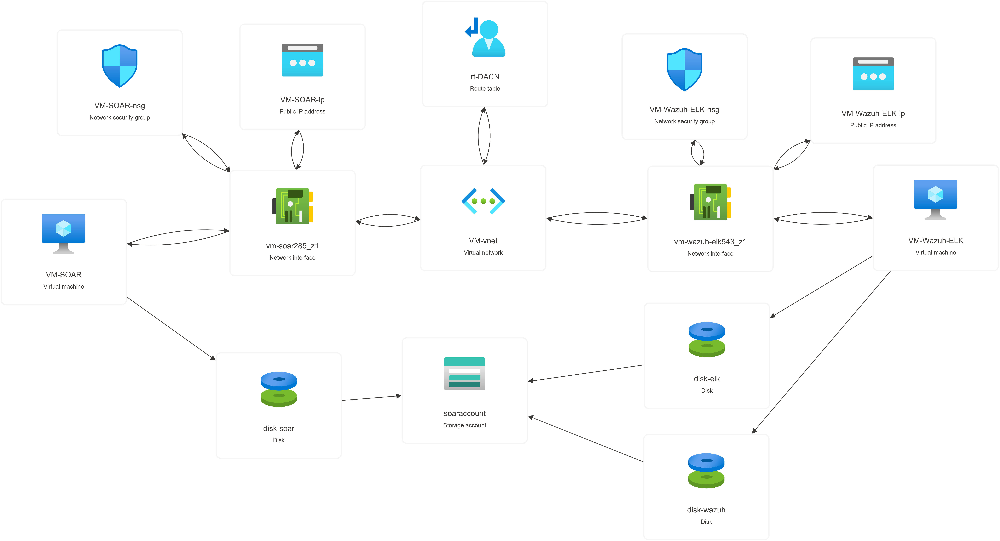

# Major Project: Research and Implementation of a Security Operations Center (SOC) with a Multi-Layered Defense Architecture and a Centralized Incident Response System

## Overview
This project is a graduation thesis focused on designing and implementing a Security Operations Center (SOC) platform for cybersecurity monitoring and incident response. The system integrates multiple open-source security tools to collect, analyze, visualize, and respond to security events across network and system environments.

## Project Objective
The main goal of this project is to build a centralized security monitoring and response environment that supports threat detection, continuous monitoring, and automated incident handling within a multi-layered defense architecture.

## Key Features
- Centralized log collection from servers, clients, and network devices
- Real-time monitoring and visualization of security events
- Threat detection using Wazuh rules and security alerts
- Automated response workflows with SOAR tools such as n8n and Shuffle
- Integration with network security components such as pfSense, Nginx, and WireGuard

## Main Technologies
- Elasticsearch
- Logstash
- Kibana
- Wazuh
- Filebeat
- n8n
- Shuffle
- pfSense
- Nginx
- WireGuard

## System Architecture
The system is organized into several layers:
1. Data Collection: logs and events are gathered from endpoints and network devices.
2. Log Processing: Logstash forwards data to Elasticsearch for indexing.
3. Visualization: Kibana provides dashboards and search capabilities.
4. Detection and Response: Wazuh analyzes events, while SOAR workflows trigger automated actions.

### Architecture Diagram

### Workflow Visuals

### Azure Implementation

## Project Structure
- BCTD/: experiment and lab-related materials
- System/ELK-Wazuh/: ELK Stack and Wazuh configuration and installation files
- System/SOAR/: workflow definitions for n8n and Shuffle
- System/Local/: local client, server, and network-related resources

## Workflow Summary
The platform collects logs from monitored systems, processes them in a centralized environment, detects suspicious behavior, and generates alerts. When an alert is triggered, automated workflows can notify administrators or execute predefined response actions.

## Expected Outcome
This project demonstrates how modern security monitoring and automation tools can be integrated to improve visibility, strengthen defense mechanisms, and reduce response time during cyber incidents.

## Notes
This README provides a general overview of the project. Additional technical details, implementation steps, and screenshots can be added later as the project evolves.
